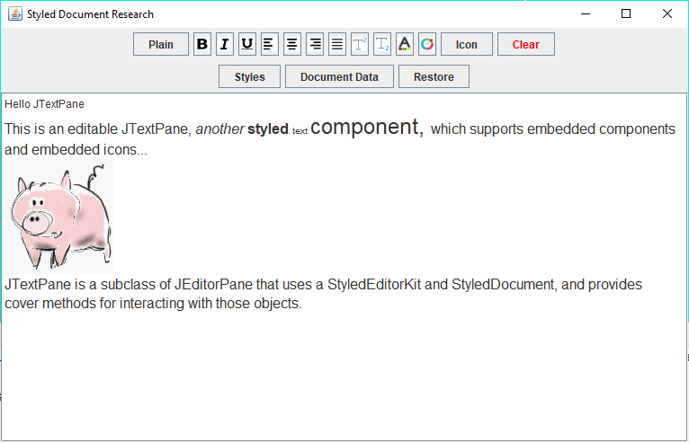
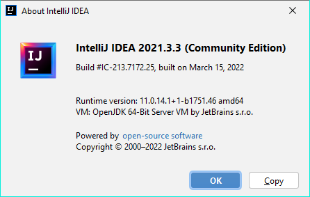

# DocToJSON
A Research app.  Shows that it is possible to make a JSON string from a StyledDocument, 
and read it back in.

Code was built with:

So, the .idea folder is also included for various settings and libraries, in case you 
are using a compatible version. 

Lots of comments and what others will consider 'noise' - no apologies; as already
stated the purpose here was for my own research and edification.

To use - build and run the main app.  Use the editor controls on the initial text
and/or add your own.  When you click on 'Document Data', the document innards are
spewed to the console and then so is the ~equivalent JSON object in String format.
Then, the StyledDocumentData object is used to populate a new, empty StyledDocument
and that doc is put into the JTextPane.  If all goes well, in the app you will see
no difference at all between the old and the new.

The key here is that the StyledDocument can be parsed into a StyledDocumentData
instance, and that instance can be used to populate the content of a StyledDocument.

From there, saving and loading of JSON String data to/from a StyledDocumentData 
can be trivial.  